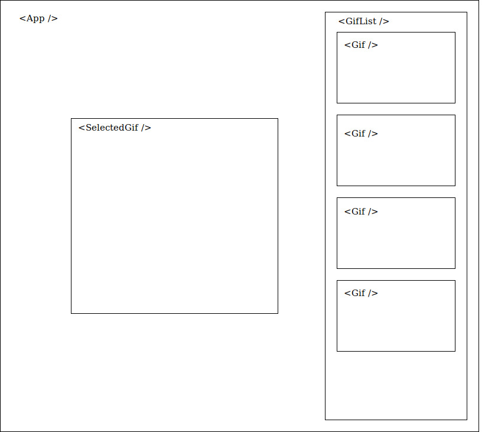
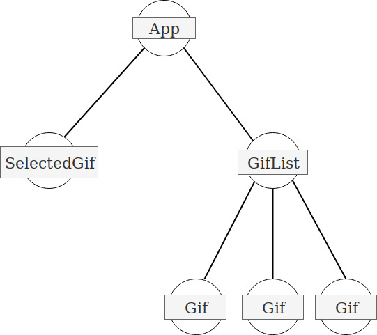

# React Giphy


## Description
Create a page that will display a list of gifs and show the selected gif.


1. create the components according to the [diagram](./react-giphy-diagram.jpg):


2. on `App`, fetch from giphy API. **Don't forget to create your API key!**
```http://api.giphy.com/v1/gifs/search?api_key=${apiKey}&q=ryan+gosling&limit=5```

3. iterate over a list of 5 gifs, and display a `Gif` component for each element of the array on `GifList`.

4. create a method `handleSelectedGif` that will receive an argument `clickedGif`.

5. when clicking on a `Gif`, it updates the state with the `clickedGif`. 

6. show on `SelectedGif` component the clicked gif.